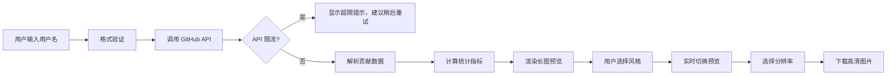

## 1. 产品概述

GitHub 贡献历史长图生成器，将用户的 GitHub 年度贡献数据转化为可下载的艺术长图。
- 面向开源爱好者、开发者，用于展示个人代码贡献历程，制作数字艺术作品
- 产品价值：将冰冷的提交数据转化为具有艺术感和纪念意义的视觉作品

## 2. 核心功能

### 2.1 用户角色

| 角色 | 注册方式 | 核心权限 |
|------|----------|----------|
| 访客用户 | 无需注册 | 输入用户名、生成图片、下载图片 |

### 2.2 功能模块

1. **首页**：用户名输入、风格选择、数据获取与展示
2. **长图预览区**：365天贡献方格可视化、统计数据展示、风格切换
3. **下载功能**：高清图片导出、格式选择

### 2.3 页面详情

| 页面名称 | 模块名称 | 功能描述 |
|---------|----------|----------|
| 首页 | 输入区域 | GitHub 用户名输入框、获取数据按钮、加载状态指示 |
| 首页 | 风格选择器 | 四种风格卡片：古籍卷轴、数据磁带、彩虹编码、极简黑白，点击切换预览 |
| 首页 | 长图预览区 | 365天贡献方格纵向排列，标注连续贡献纪录和最高产日 |
| 首页 | 统计面板 | 总提交数、最长连续天数、最活跃月份数据展示 |
| 首页 | 下载区域 | 分辨率选择、下载按钮、API 超限提示 |

## 3. 核心流程

用户输入 GitHub 用户名 → 验证用户名格式 → 调用 GitHub API 获取贡献数据 → 解析并计算统计数据 → 渲染可视化长图 → 用户选择风格 → 实时预览切换 → 选择分辨率 → 下载高清图片

## 4. 用户界面设计

### 4.1 设计风格
- 主色调：深灰 #1a1a2e 作为背景，搭配每种风格的专属配色
- 字体：展示字体使用 "Noto Serif SC"（古籍感）与 "JetBrains Mono"（数据感）的组合，正文字体使用 "Inter"
- 布局：左右分栏，左侧为控制面板，右侧为长图预览区（可滚动）
- 按钮风格：圆润玻璃态按钮，hover 时有微妙的光晕效果
- 图标风格：线性简约图标，配合风格主题变化

### 4.2 页面设计概览

| 页面名称 | 模块名称 | UI 元素 |
|---------|----------|----------|
| 首页 | 输入区域 | 大字号标题、优雅的输入框、带有加载动画的按钮 |
| 首页 | 风格选择器 | 四张卡片式选择器，每张有风格缩略图和名称，选中时有边框高亮 |
| 首页 | 长图预览区 | 纵向滚动容器，365天方格阵列，特殊日期标注浮层 |
| 首页 | 统计面板 | 三个大数字卡片，带有图标和描述文字 |
| 首页 | 下载区域 | 下拉选择器、醒目的下载按钮、小字提示 |

### 4.3 响应式设计
- 桌面端（默认）：左右分栏布局，左侧固定宽度 380px，右侧自适应
- 平板端：上下布局，控制面板在上，预览区在下
- 移动端：单列布局，优化触摸交互，增大按钮尺寸

### 4.4 四种视觉风格详解

**1. 古籍卷轴风格**
- 配色：米黄宣纸底色、深褐墨色、朱红印章色
- 装饰：上下卷轴杆、淡墨纹理背景、毛笔书法字体、印章元素
- 方格：仿雕版印刷效果，深浅墨色代表贡献量

**2. 数据磁带风格**
- 配色：深黑底色、荧光绿、磁带回声纹理
- 装饰：磁带卷轴元素、二进制数据流装饰、像素字体、扫描线效果
- 方格：像磁带磁道一样排列，LED 灯珠发光效果

**3. 彩虹编码风格**
- 配色：渐变彩虹色谱、深色背景衬托
- 装饰：彩色光晕、色散效果、玻璃态质感
- 方格：按贡献量映射到彩虹色阶，零贡献为深灰

**4. 极简黑白风格**
- 配色：纯白背景、纯黑方格、灰色层次
- 装饰：极简几何线条、无多余装饰、留白充足
- 方格：只有黑白灰三色，强调数据本身的韵律

