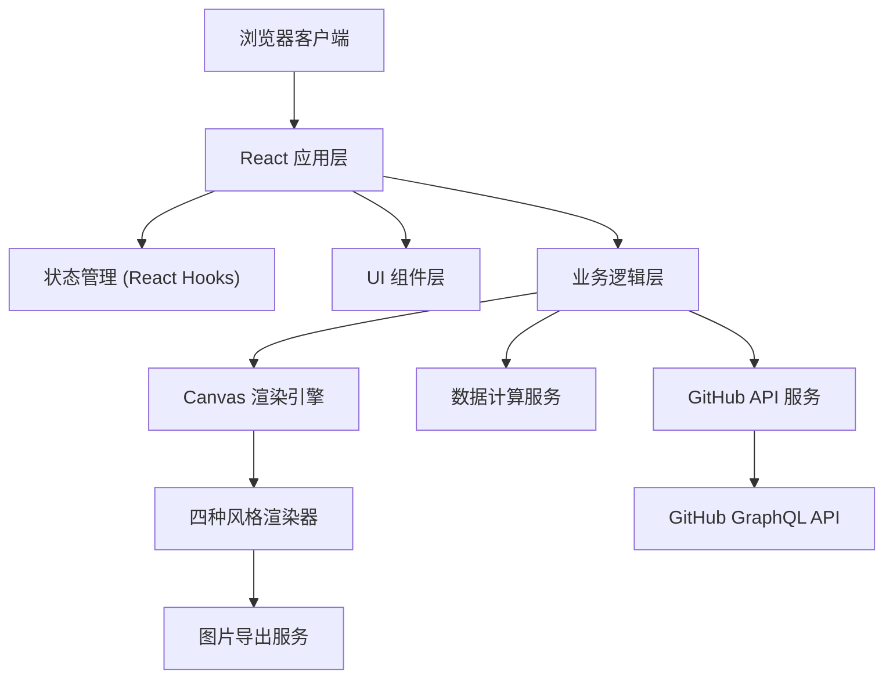
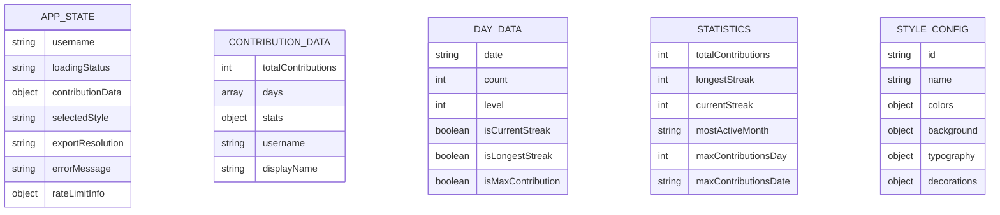

## 1. 架构设计

纯前端单页应用，无需后端服务，直接调用 GitHub API 获取数据，客户端渲染并导出图片。



## 2. 技术描述

- **前端框架**: React@18 + TypeScript + Vite@5
- **样式方案**: TailwindCSS@3 + CSS 变量
- **Canvas 渲染**: 原生 Canvas 2D API，不依赖第三方渲染库
- **图片导出**: Canvas toDataURL / toBlob，支持 PNG 格式
- **数据获取**: GitHub GraphQL API v4
- **状态管理**: React useState + useReducer + Context
- **动画**: CSS Transitions + Framer Motion（微交互）
- **字体**: Google Fonts (Noto Serif SC, JetBrains Mono, Inter)

## 3. 路由定义

| 路由 | 用途 |
|------|------|
| / | 主应用页面，包含所有功能 |

## 4. API 定义

### 4.1 GitHub GraphQL API - 获取用户贡献数据

**请求类型**: POST

**Endpoint**: `https://api.github.com/graphql`

**请求头**:
```typescript
{
  Authorization: `bearer ${token}`, // 可选，匿名调用有速率限制
  'Content-Type': 'application/json'
}
```

**GraphQL 查询**:
```graphql
query($username: String!) {
  user(login: $username) {
    login
    name
    avatarUrl
    contributionsCollection {
      contributionCalendar {
        totalContributions
        weeks {
          contributionDays {
            date
            contributionCount
            weekday
          }
        }
      }
    }
  }
}
```

**响应类型定义**:
```typescript
interface ContributionDay {
  date: string;
  contributionCount: number;
  weekday: number;
}

interface ContributionWeek {
  contributionDays: ContributionDay[];
}

interface ContributionCalendar {
  totalContributions: number;
  weeks: ContributionWeek[];
}

interface GitHubUser {
  login: string;
  name: string | null;
  avatarUrl: string;
  contributionsCollection: {
    contributionCalendar: ContributionCalendar;
  };
}

interface GitHubApiResponse {
  data: {
    user: GitHubUser;
  };
  errors?: Array<{ message: string }>;
}
```

### 4.2 速率限制处理

- 匿名请求: 每小时 60 次
- 认证请求: 每小时 5000 次
- 检测到 403 响应时显示友好提示
- 客户端本地缓存最近查询结果（5分钟）

## 5. 数据模型

### 5.1 数据模型定义



### 5.2 核心数据结构

```typescript
// 单个贡献日数据
interface DayData {
  date: string; // YYYY-MM-DD
  count: number;
  level: number; // 0-4 分级
  isMaxContribution: boolean;
  inLongestStreak: boolean;
}

// 统计数据
interface Statistics {
  totalContributions: number;
  longestStreak: number;
  longestStreakStart: string;
  longestStreakEnd: string;
  currentStreak: number;
  mostActiveMonth: string; // '2024-06'
  mostActiveMonthCount: number;
  maxContributions: number;
  maxContributionsDate: string;
}

// 风格配置
interface StyleConfig {
  id: 'scroll' | 'tape' | 'rainbow' | 'minimal';
  name: string;
  background: {
    color: string;
    texture?: string; // canvas pattern
  };
  cellColors: string[]; // 5 levels, index 0 = no contributions
  textColor: string;
  accentColor: string;
  fontFamily: {
    title: string;
    body: string;
    numbers: string;
  };
}

// 导出配置
interface ExportConfig {
  width: number;
  cellSize: number;
  cellGap: number;
  padding: {
    top: number;
    right: number;
    bottom: number;
    left: number;
  };
  dpi: number;
}
```

## 6. 核心模块划分

| 模块 | 职责 | 文件路径 |
|------|------|----------|
| API 服务层 | GitHub API 调用、错误处理、限流检测 | `src/services/githubApi.ts` |
| 数据处理层 | 解析原始数据、计算统计指标、分级处理 | `src/services/dataProcessor.ts` |
| 风格配置层 | 四种风格的配色、字体、装饰配置 | `src/config/styles.ts` |
| Canvas 渲染层 | 长图绘制、网格渲染、标注绘制 | `src/services/canvasRenderer.ts` |
| 导出服务层 | 高清图片生成、下载触发 | `src/services/exportService.ts` |
| UI 组件层 | 输入、选择器、预览、下载面板 | `src/components/` |
| 状态管理层 | 全局状态、数据流 | `src/hooks/useAppState.ts` |

